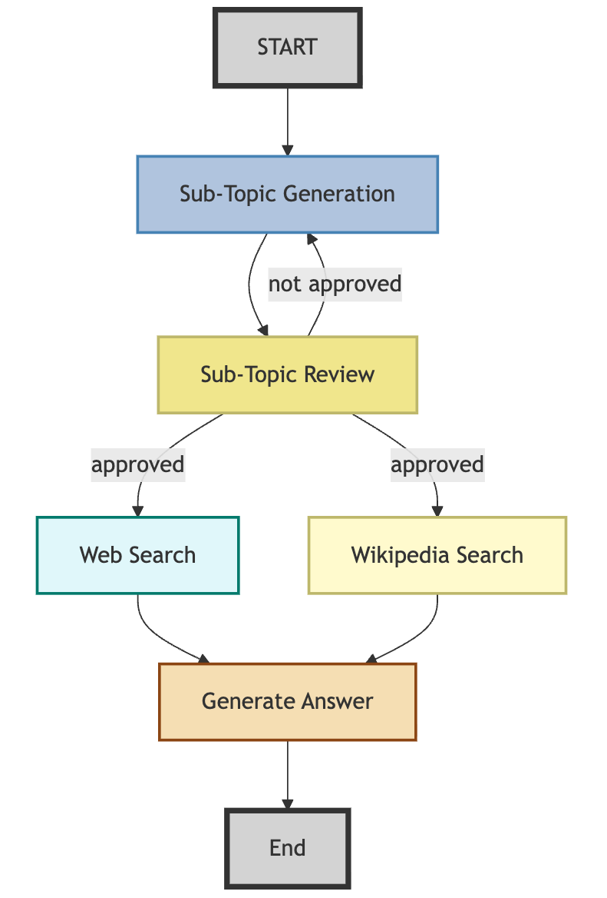

# research-assistant
An agentic search assistant built using LangGraph to break down user queries into sub-topics, perform web and Wikipedia searches, and generate a summarized answer, using a map-reduce approach to process and combine search results.
The assistant Flow:

